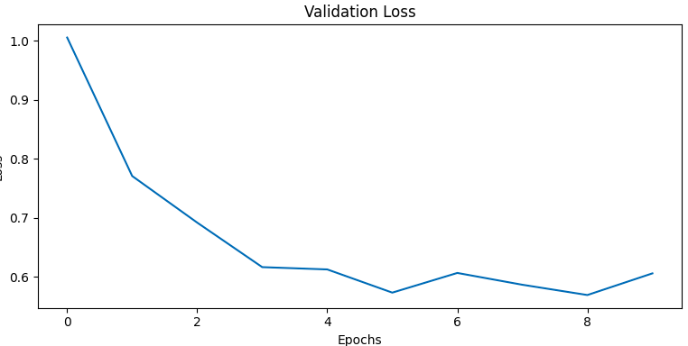
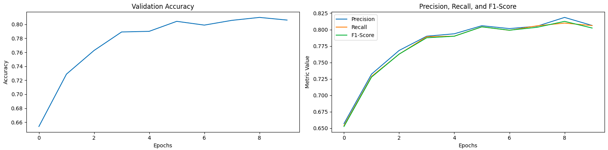

# Домашнее залание 1

Задание было выполнено в [Google Colab](https://colab.research.google.com/drive/1WMulTwemIeIYnX14bRMdpxvh_tgZ1hGR?usp=sharing)

Задача: многоклассовая классиикация

Классы:
- plane
- car
- bird
- cat
- deer
- dog
- frog
- horse
- ship
- truck

Архитектура: Mobile Net v3 large
Гипперпараметры:
- оптимайзер: Adam
- lr: 0.001
- epoch: 10
- batch: 128

Лоссы: Cross Entropy Loss

1. Цель эксперимента:

    Получить высокие значения метрик в задаче классификации изображений на датасете CIFAR10.

2. Идея эксперимента:

    Использование предварительно обученной на ImageNet MobileNetv3 Large в качестве backbone для применениея Transfer learning & fine-tuning.
3. Результаты эксперимента:

|      | Precision | Recall | F1-Score |
|------|-----------|--------|----------|
| airplane    | 0.805714  | 0.846  | 0.825366 |
| automobile  | 0.905295  | 0.889  | 0.897074 |
| bird        | 0.748609  | 0.807  | 0.776708 |
| cat         | 0.592527  | 0.666  | 0.627119 |
| deer        | 0.801793  | 0.805  | 0.803393 |
| dog         | 0.685845  | 0.751  | 0.716945 |
| frog        | 0.945679  | 0.766  | 0.846409 |
| horse       | 0.870314  | 0.859  | 0.864620 |
| ship        | 0.925439  | 0.844  | 0.882845 |
| truck       | 0.903967  | 0.866  | 0.884576 |

5. Выводы:

    Получены высокие значения метрик accuracy, precision, recall и f1-score для конкретных классов.
    Уменьшение времени достижения пика производительности за счет эффективного использования предварительно обученной модели.