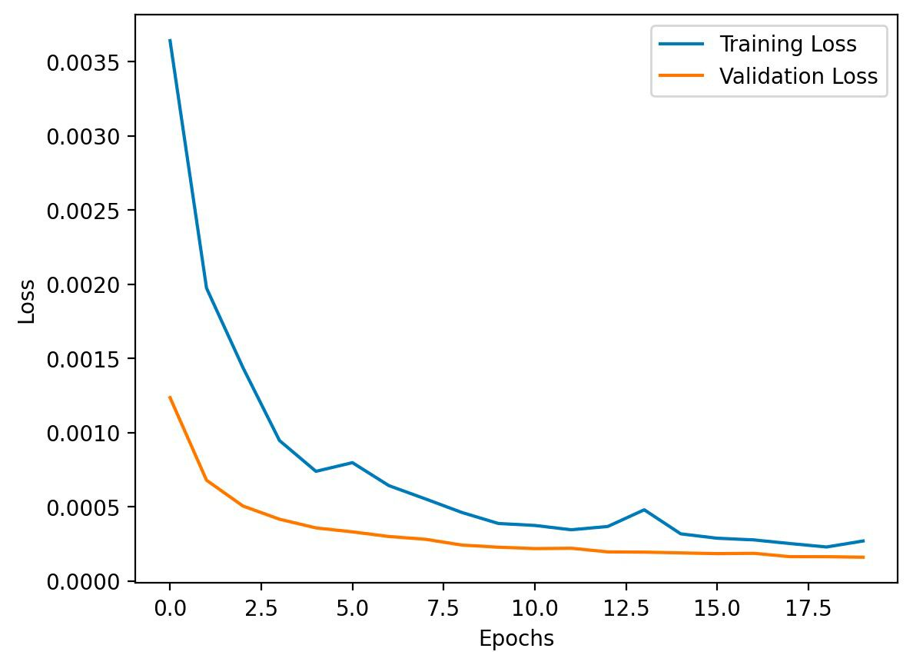
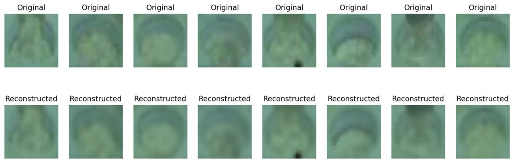
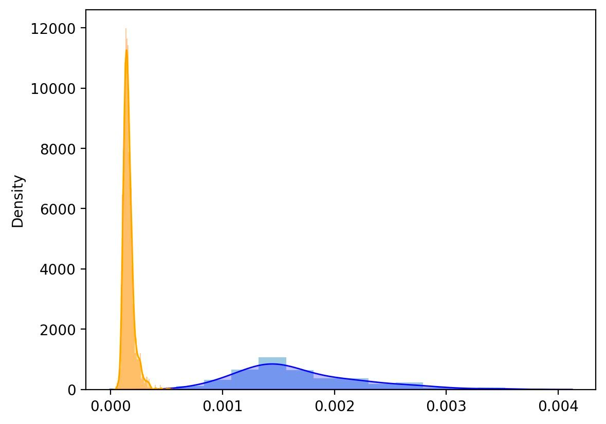

# Домашнее задание 2

Архитекура: Кастомный сверточный автоэнкодер на 2.6млн параметров

- оптимизатор: AdamW
- lr: 0.001
- epoch: 20
- batch: 128

Лосс: MSE Loss

1. Цель эксперимента

Решить задачу Anomaly detection, используя автоэнкодеры, научится отличать изображения пролива от не_пролива

2. Идея эксперимента

Использовать сверточный автоэнкодер и научиться восстанавливать исходные изображения проливов, подобрать пороговое значение по которому можно отсекать проливы и не_проливы

Распределение ошибки MSE для проливов и не_проливов

Полученные метрики

TPR 0.9362
FPR 0.9265

