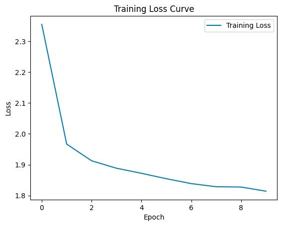
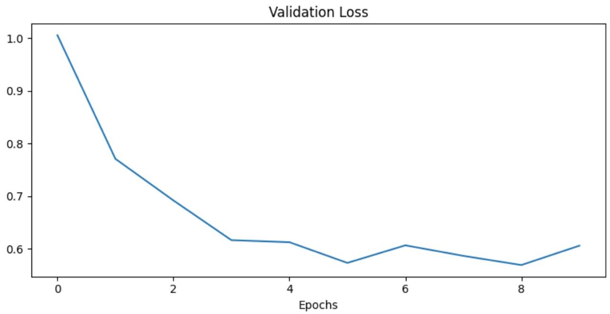
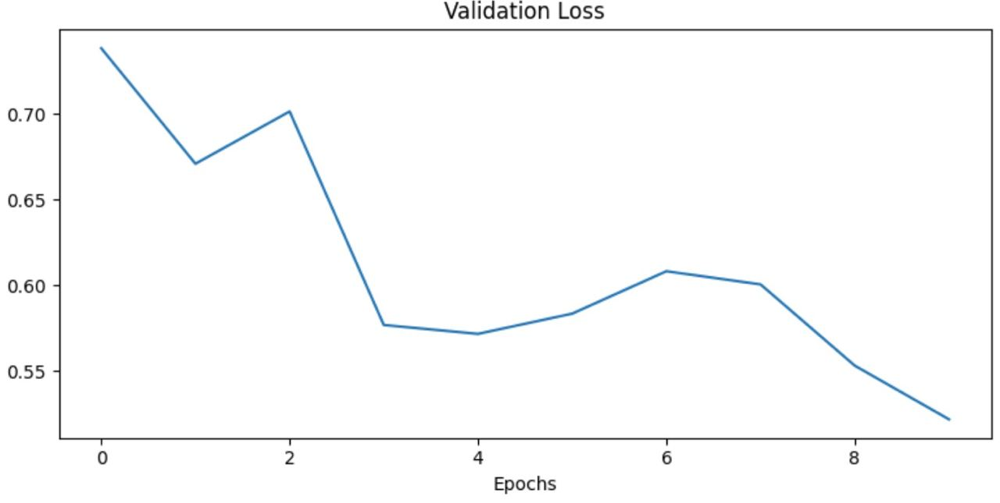
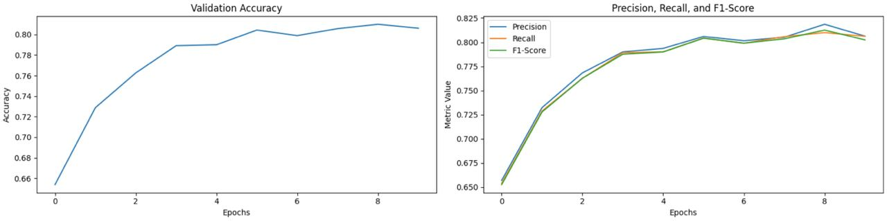
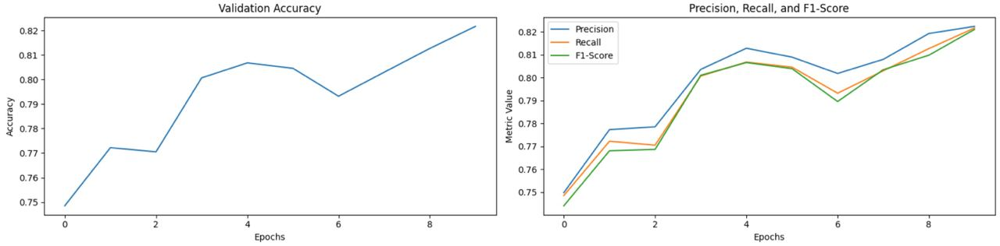
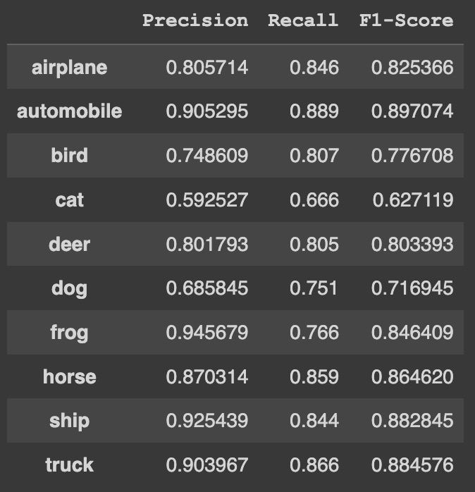
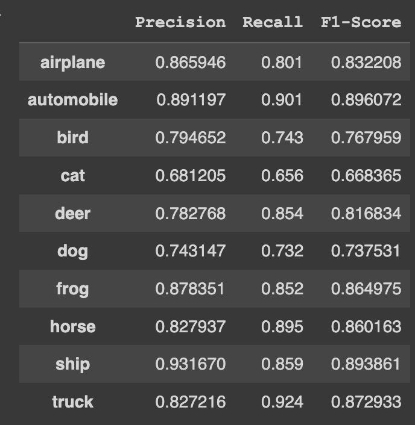

# Домашнее задание 3. Self-Supervised Learning

Ссылка на Colab: https://colab.research.google.com/drive/1k16APcfYf17jjZuaNO1uUdeoGXnU6lms?usp=sharing

## Эксперимент 1

Была обучена архитектура MobileNetV3 Large через подход SSL 

Оптимизатор AdamW
Лосс CrossEntropyLoss

График функции потерь
 

### Сравнение с архитектурой без SSL предобучения

Лосс из ДЗ1

Лосс SSL

График метрик из ДЗ1

График метрик SSL

Таблица метрик из ДЗ1

Таблица метрик SSL

### Выводы

Благодаря SSL претрейну удалось получить более высокие метрики, а также более быструю сходимость модели